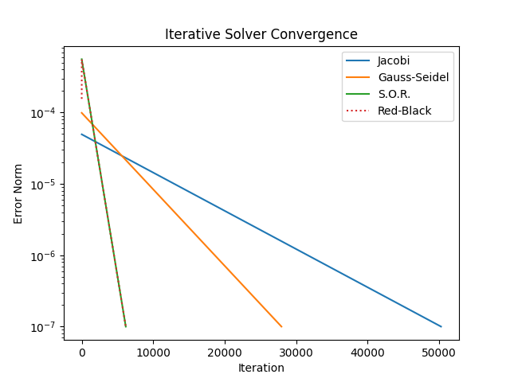

+++ 
draft = false
date = "2026-06-28"
title = "Iterative Methods and Parallelization for Solving PDEs"
description = ""
slug = "iterative-methods-parallelization"
authors = []
tags = ['HPC', 'OpenMP', 'Fortran', 'PDE']
categories = ['HPC']
externalLink = ""
series = []
+++

# Background
Elliptic PDEs are the most expensive type of PDE to solve as they require a global solve
Unfortunately, they commonly appear in many simulations.
This post will cover solution some iterative solution methods for elliptic PDEs.
Those are, in order:
- Jacobi Iteration
- Gauss Seidel
- Successive Over-Relaxation (SOR)
- Red-Black Parallelization

The Fortran programming language will be used instead of C or C++ due to its native support for multi-dimensional arrays.
The codes will be compiled with ```gfortran```.
The results will be written out to CSV files and visualized using Matplotlib in Python.

## Test Problem
The test problem will be one of the simplest examples of an elliptic PDE, Poisson's Equation:
$$
\nabla^2 \phi = f
$$

In two dimensions, this is:
$$
\frac{\partial^2 \phi}{\partial x^2} + \frac{\partial^2 \phi}{\partial y^2} = f
$$

And, it is discretized as:
$$
\frac{\phi_{i+1,j} - 2 \phi_{i, j} + \phi_{i-1, j}}{\Delta x^2} + \frac{\phi_{i,j+1} - 2 \phi_{i, j} + \phi_{i,j-1}}{\Delta x^2} =  f_{i,j}
$$

Direchlet boundary conditions will be used everywhere, as they are the simplest to implement. We will just set all points on the boundary to be zero.
The grid will be uniform in both directions so that $h=\Delta x=\Delta y$.
The source function on the right hand side is:
$$
f = 2\pi^2\sin(\pi x)\sin(\pi y)
$$

The analyical solution to this equation is:
$$
\phi(x,y) = \sin(\pi x) \sin(\pi y)
$$

In the following, the linear system $Ax=b$ is solved, where $A$ the coefficient matrix and $a_{ij}$ are the entries of $A$. The vector $x$ is the solution to the system, and $b$ is the right hand side.

Note that for the test problem considered here, each point depends only on its immediate neighbors.
For simplicity, $\phi$ and $f$ will be stored as an $n\times n$ matrices.
In Fortran, this can be declared as:

```Fortran
real, dimension(51, 51) :: phi
real, dimension(51, 51) :: f
```

# Iterative Methods
Unlike _direct methods_ for solving linear systems, _iterative methods_ start with an initial guess and calculate a corrected value (or, a value that is hopefully more correct).
This process repeats until the corrected values are sufficiently similar between iterates.
Depending on properties of the linear system being solved, iterative methods are not always guaranteed to converge.

Taking the previously described discretization of the Poisson equation, the value calculated at each iteration for each grid point is:
$$
\phi_{i,j} = \frac{\phi_{i+1,j}+\phi_{i-1,j}+\phi_{i,j+1}+\phi_{i,j-1}}{4}
$$

## Jacobi Method
The Jacobi method updates all points at once based on their previous values.
$$
    x_i^{(k+1)} = \frac{1}{a_{ii}} \left( b_i - \sum_{j\neq 1} a_{ij} x_j^{(k)} \right)
$$
The implementation as shown below.
The values of the current iterate are stored in ```phi```, and the values of the previous iterate are stored in ```phi_old```.
Convergence is determined when the average absolute change per grid point drops below a specified threshold.
```Fortran
subroutine jacobi_solver(phi, f, h, history, tol)
    real(real64), dimension(:, :), intent(inout) :: phi
    real(real64), dimension(:, :), intent(in) :: f
    real(real64), intent(in) :: h
    real(real64), dimension(:), intent(inout) :: history
    real(real64), intent(in) :: tol

    real(real64), dimension(size(phi, 1), size(phi, 2)) :: phi_old
    real(real64) :: update
    
    integer :: i, j, itr, max_itr
    integer :: nx, ny

    max_itr = size(history)

    nx = size(phi, 1)
    ny = size(phi, 2)

    do itr = 1, max_itr
        phi_old = phi
        update = 0
        do j = 2, ny-1
            do i = 2, nx-1
                phi(i, j) = (phi_old(i+1, j) + phi_old(i-1, j) + phi_old(i, j+1) + phi_old(i, j-1) - f(i, j) * h**2) / 4
                update = update + abs(phi(i, j) - phi_old(i, j))
            end do
        end do
        update = update / (nx * ny)
        history(itr) = update
        if (update <= tol) then
            print *, "Jacobi solver converged at iteration", itr
            return
        end if
    end do
end subroutine
```

## Gauss Seidel
The Gauss Seidel method improves on the convergence rate of the Jacobi method by using the updated values as soon as they are available.
$$
    x_i^{(k+1)} = \frac{1}{a_{ii}} \left( b_i - \sum_{j=1}^{i-1} a_{ij} x_j^{(k+1)} - \sum_{j=i+1}^{n} a_{ij} x_j^{(k)} \right)
$$
In the implementation below, notice that there is no longer a ```phi_old``` variable.
```Fortran
subroutine gauss_seidel(phi, f, h, history, tol)
    real(real64), dimension(:, :), intent(inout) :: phi
    real(real64), dimension(:, :), intent(in) :: f
    real(real64), intent(in) :: h
    real(real64), dimension(:), intent(inout) :: history
    real(real64), intent(in) :: tol

    real(real64) :: update
    real(real64) :: oldvalue
    
    integer :: i, j, itr, max_itr
    integer :: nx, ny

    max_itr = size(history)

    nx = size(phi, 1)
    ny = size(phi, 2)

    do itr = 1, max_itr
        update = 0
        do j = 2, ny-1
            do i = 2, nx-1
                oldvalue = phi(i, j)
                phi(i, j) = (phi(i+1, j) + phi(i-1, j) + phi(i, j+1) + phi(i, j-1) - f(i, j) * h**2) / 4
                update = update + abs(phi(i, j) - oldvalue)
            end do
        end do
        update = update / (nx * ny)
        history(itr) = update
        if (update <= tol) then
            print *, "Gauss-Seidel solver converged at iteration", itr
            return
        end if
    end do
end subroutine
```

## Successive Over-Relaxation (SOR)
The method of Successive Over-Relaxation aims to further improve the convergence rate of the Gauss Seidel method by "overstepping" when calculating the next value.
$$
    x_i^{(k+1)} = (1-r)x_i^{(k)} + \frac{r}{a_{ii}} \left( b_i - \sum_{j=1}^{i-1} a_{ij} x_j^{(k+1)} - \sum_{j=i+1}^{n} a_{ij} x_j^{(k)} \right)
$$
The implementation is identical to that of Gauss-Seidel, with one exception: the appearance of ```r```.
This variable is what allows SOR to "overstep" or "overcorrect" on each iteration.
When $r\in(1,2)$, SOR will converge faster than Gauss-Seidel.
When $r\in(0,1)$, SOR will converge slower than Gauss-Seidel (since this is technically under-relaxed).
```Fortran
subroutine sor(phi, f, h, history, tol, r)
    real(real64), dimension(:, :), intent(inout) :: phi
    real(real64), dimension(:, :), intent(in) :: f
    real(real64), intent(in) :: h
    real(real64), dimension(:), intent(inout) :: history
    real(real64), intent(in) :: tol
    real(real64), intent(in) :: r

    real(real64) :: update
    real(real64) :: oldvalue, newvalue
    
    integer :: i, j, itr, max_itr
    integer :: nx, ny

    max_itr = size(history)

    nx = size(phi, 1)
    ny = size(phi, 2)

    do itr = 1, max_itr
        update = 0
        do j = 2, ny-1
            do i = 2, nx-1
                oldvalue = phi(i, j)
                newvalue = (phi(i+1, j) + phi(i-1, j) + phi(i, j+1) + phi(i, j-1) - f(i, j) * h**2) / 4
                phi(i, j) = (1 - r) * phi(i, j) + r * newvalue
                update = update + abs(phi(i,j) - oldvalue)
            end do
        end do
        update = update / (nx * ny)
        history(itr) = update
        if (update <= tol) then
            print *, "S.O.R. solver converged at iteration", itr
            return
        end if
    end do
end subroutine
```

# Comparisons
<!--```
Running: Jacobi Iteration Method
/usr/bin/time -p ./exe_jacobi
 Jacobi solver converged at iteration       50292
real 1.67
user 1.67
sys 0.01
Running: Gauss-Seidel Method
/usr/bin/time -p ./exe_gs
 Gauss-Seidel solver converged at iteration       27956
real 3.97
user 4.03
sys 0.01
Running: Successive Over-Relaxation Method
/usr/bin/time -p ./exe_sor
 S.O.R. solver converged at iteration        6167
real 1.17
user 1.17
sys 0.01
Running: Red-Black Over-Relaxation Method
/usr/bin/time -p ./exe_rb
 Running with          12 threads
 Red-Black solver converged at iteration        6166
real 0.18
user 1.85
sys 0.01
```-->

The table below summarizes the performance of each method.
The tolerance for convergence was set to $1\times 10^{-7}$, and the walltime was obtained by prepending ```time -p``` to the call.
Where applicable, the over-relaxation factor was set to $1\times 10^{-7}$.
The error norm is determined via comparison to the analytical solution.

| Method | Iterations | Walltime | Error Norm @ Convergence |
| --- | --- | --- | --- |
| Jacobi | 50292 | 1.67s | 0.200 |
| Gauss-Seidel | 27956 | 3.97s | 0.099 |
| Successive Over-Relaxation | 6167 | 1.17s | 0.016 |

When moving from Jacobi to Gauss-Seidel, the total number of iterations required to converge drops significantly, but the total wall time actually increases.
This is due to caching behavior.
The Jacobi method writes all the values at once. These values are then copied to store old values for the next iteration.
The Gauss-Seidel method updates a value and immediately uses that updated value at the next grid point.
While this reduces the number of iterates required to converge, the algorithm forces the CPU to wait until the value is written to memory before reading it again.
It is this "roundtrip" that causes Gauss-Seidel to have increased walltime.
This highlights why memory access patterns are important to keep in mind. Here, we can reclaim the walltime with over-relaxation.

The other thing worth noting is the error norm at convergence.
The iteration matrix for the Jacobi method is known to damp high-frequency errors quickly, but low-frequency errors tend to linger.
This manifests as increased error at convergence. 
It can be resolved via multi-grid methods, which are beyond the scope of this post.

From these results, the benefit of the method of Successive Over-Relaxation is apparent.
However, all of these methods run on a single CPU core.
We can further speedup the solution by using multiple CPU cores.


# Parallelization
The Red-Black scheme is more like a cross between Successive Over-Relaxation and Jacobi Method.
The key idea is to parallelize the update of all grid points that do not depend on each other.
This is easily visualized by imagining a checkerboard - the values at all the red points can be updated from the values at the black points, and the values at all the black points can be updated from the values at the red points.
These two groups of points do not interfere with each other, and so their updates can be parallelized without causing a race condition or corrupting memory.

The implementation is similar to that of the method of Successive Over-Relxation, with the exception of the addition of a ```color``` loop, which is run twice.
The value of ```color``` is used to determine if the red or black points are being updated.
The ```ioffset``` variable, which is either 0 or 1, tells the ```i``` loop (which skips every other grid point) where to start.
The ```j``` loop is then parallelized with an OpenMP directive.
- ```PARALLEL``` denotes a parallel region
- ```DO``` lets the compiler know that the following Fortran DO loop can be parallelized with OpenMP
- ```PRIVATE``` is used to specify the variables that each OpenMP thread will receive a private copy of.
- ```REDUCTION``` lets the compiler know that each thread will have its own copy of ```local_update```. When exiting the loop, all the copies of ```local_update``` will be reduced via the specified operation (here, addition) into a single copy of the variable. We do this twice so that the total update is calculated as the sum of the local updates from the red and black loops.

```Fortran
subroutine rb(phi, f, h, history, tol, r)
    real(real64), dimension(:, :), intent(inout) :: phi
    real(real64), dimension(:, :), intent(in) :: f
    real(real64), intent(in) :: h
    real(real64), dimension(:), intent(inout) :: history
    real(real64), intent(in) :: tol
    real(real64), intent(in) :: r

    real(real64) :: oldvalue
    real(real64) :: newvalue
    real(real64) :: update
    real(real64) :: local_update

    integer :: i, j, itr, max_itr
    integer :: nx, ny
    integer :: color
    integer :: ioffset

    print *, "Running with", omp_get_max_threads(), "threads"

    max_itr = size(history)

    nx = size(phi, 1)
    ny = size(phi, 2)

    do itr = 1, max_itr
        update = 0
        do color = 1,2
            local_update = 0  ! using an OpenMP reduction is faster than a critical block within parallel region
            !$OMP PARALLEL DO PRIVATE(i, ioffset, oldvalue, newvalue) REDUCTION(+:local_update)
            do j = 2, ny-1
                ioffset = mod(j+color, 2)
                do i = 2 + ioffset, nx-1, 2
                    oldvalue = phi(i, j)
                    newvalue = (phi(i+1, j) + phi(i-1, j) + phi(i, j+1) + phi(i, j-1) - f(i, j) * h**2) / 4
                    phi(i, j) = (1 - r) * phi(i, j) + r * newvalue
                    local_update = local_update + abs(phi(i, j) - oldvalue)
                end do
            end do
            !$OMP END PARALLEL DO
            update = update + local_update
        end do
        update = update / (nx * ny)
        history(itr) = update
        if (update <= tol) then
            print *, "Red-Black solver converged at iteration", itr
            return
        end if
    end do
end subroutine
```

Recall the caching / roundtrip memory access discussed previously.
Red-black memory access patterns are great for parallelization, but they also do not have any roundtrip memory accesses.
This means that a red-black method may show a faster runtime even on one thread (without parallelization), simply due to the improved memory access pattern.

By default, OpenMP will farm the work out to all available hardware threads on the system, including hyperthreading / symmetric multi-threading (depending on if your processor is Intel or AMD).
This can be controled with environment variables, such as OMP_NUM_PLACES and OMP_PLACES, which are used to control the number of OMP workers and where those workers are bound to.
For example:
```bash
$> env OMP_PLACES='threads' OMP_NUM_PLACES=4 ./executable_program
```

The table below shows all results with the OpenMP results included.
The Red-Black OpenMP version is run with both 12 threads and on a single thread.
The over-relaxation factor was also set to $1\times 10^{-7}$.
Notice that both thread counts result in significantly faster performance.
From this, it can be inferred that the memory access pattern contributes significantly to improving the runtime.

| Method | Iterations | Walltime | Error Norm @ Convergence |
| --- | --- | --- | --- |
| Jacobi | 50292 | 1.67s | 0.200 |
| Gauss-Seidel | 27956 | 3.97s | 0.099 |
| Successive Over-Relaxation | 6167 | 1.17s | 0.016 |
| _**Red-Black Over-Relaxation (12 threads)**_ | 6166 | _**0.18s**_ | 0.016 |
| _**Red-Black Over-Relaxation (1 thread)**_ | 6166 | _**0.31s**_ | 0.016 |


The following plot provides an alternate way of visualizing the number of iterations required to converge.



# Summary
This post covered the basics of iterative methods for solving PDEs.
The convergence rate and walltime of different methods was explored, and used to motivate the introduction of red-black schemes for parallelization with OpenMP.
Future posts will use this in examples of actual CFD codes rather than on toy problems, and potentially explore multigrid methods as well.