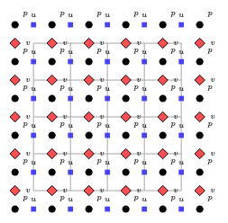
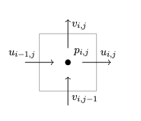
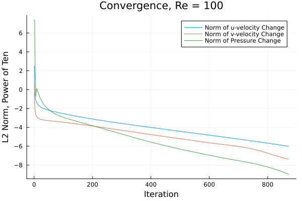
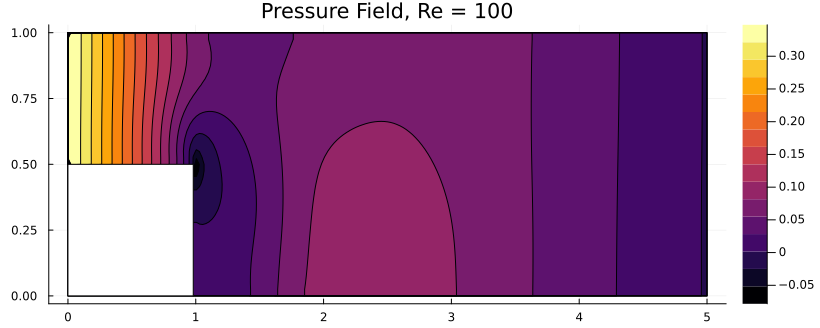
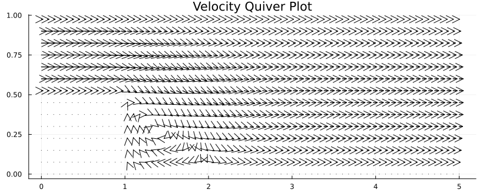

+++ 
draft = false
date = 2026-06-13
title = 'Staggered Grid'
description = ""
slug = ""
authors = []
tags = ['CFD', 'Julia']
categories = ['CFD']
externalLink = ""
series = ['CFD-in-Julia']
+++

In a previous [post](), the vorticity-streamfunction formulation of the Navier-Stokes equations was used to simulate flow over a backwards facing step.
This post will simulate flow over the backwards facing step using the primitive variable approach and a staggered grid.

To briefly summarize, a key advantage of the streamfunction-vorticity approach is that there is no pressure-velocity coupling.
This is because there is no pressure term in the vorticity transport equation.
However, treatment of boundary conditions is slightly more difficult as values for the streamfunction must also be calculated.

The primitive variable formulation of the Navier-Stokes equations contains terms for both the velocity field and the pressure field, which is where the coupling issue arises.
To resolve this, the projection method can be used.
Here, the projection method will be implemented on a staggered grid.

# Projection Method

The projection method arises from the Helmholtz-Hodge decomposition of a vector field into divergence-free and irrotational components.
It consists of the following two steps:
1) Ignoring the pressure gradient, calculate a tentative velocity field $u^\*$ from: $\frac{u^*-u^n}{\Delta t} = -(u^n \cdot \nabla) u^n + \nu \nabla^2 u^n$.
2) Project the tentative velocity field into the space of incompressible velocity fields using $u^{n+1}=u^\*- \Delta t \nabla p^{n+1}$.
    - This requires the solution of a Poisson equation for the pressure field: $\nabla^2p^{n+1}=\frac{1}{\Delta t}\nabla \cdot u^\*$.

<!--\begin{equation} \label{eqn:proj_step_1}-->
<!--\end{equation}-->

<!--\begin{equation} \label{eqn:proj_step_2}-->
<!--\end{equation}-->

<!--\begin{equation} \label{eqn:ppp} % projection presssure poisson-->
<!--\end{equation}-->

# Staggered Grid

For a user-defined grid of size $(n_x, n_y)$, the u-velocity field has size $(n_x, n_y+1)$ and the v-velocity field has size $(n_x+1, n_y)$.
The pressure field has size $(n_x+1, n_y+1)$, where the outermost ring of pressure nodes are so-called "ghost nodes".
These ghost nodes are not part of the actual domain, but make it easy to define Neumann boundary conditions for the pressure.
(This is why the fully staggered grid was chosen, as opposed to a partially staggered grid where only the velocity components are staggered and pressure nodes remain at grid vertices.)

The staggered grid looks like this.
The vertices of the user-defined grid are used to draw cells (shown in gray), and the velocity components (shown as blue and red) are placed at the faces of these cells.
The pressure nodes (shown as black dots) are then placed at the cell centers, with an extra ring of "ghost nodes" added around the outside of the domain.

And, here is a close-up of a pressure node.

Note that the grids used here are equally spaced; if this was not the case, extra care would be required to place the pressure nodes at cell centers.
If grids with unequal spacings are used, the finite volume method may be desired over the finite difference method utilized here.

# Discretization

## Tentative Velocity
The discretization of the momentum equations for the tentative velocity calculations is as follows.

$$
    u_{i,j}^* = u_{i,j} + \Delta t \bigg( \frac{1}{Re}\big( \frac{u_{i+1,j}-2u_{i,j}+u_{i-1,j}}{\Delta x^2} + \frac{u_{i,j+1}-2u_{i,j}+u_{i,j-1}}{\Delta y^2} \big) - u_{i,j}\frac{u_{i+1,j}-u_{i-1,j}}{2\Delta x} - \overline{v_{i,j}}\frac{u_{i,j+1}-u_{i,j-1}}{2\Delta y} \bigg) \\\\
    v_{i,j}^* = v_{i,j} + \Delta t \bigg( \frac{1}{Re}\big( \frac{v_{i+1,j}-2v_{i,j}+v_{i-1,j}}{\Delta x^2} + \frac{v_{i,j+1}-2v_{i,j}+v_{i,j-1}}{\Delta y^2} \big) - \overline{u_{i,j}}\frac{v_{i+1,j}-v_{i-1,j}}{2\Delta x} - v_{i,j}\frac{v_{i,j+1}-v_{i,j-1}}{2\Delta y} \bigg)
$$

Note that the overbar is used to denote an interpolated quantity.
This is necessary since the v-velocity is not readily available at node (i,j) on the u-velocity grid, and vice versa for the u-velocity on the v-velocity grid.
$$
\overline{v_{i,j}} = \frac{ v_{i,j} + v_{i,j-1} + v_{i+1,j} + v_{i+1,j-1}}{4}
$$
$$
\overline{u_{i,j}} = \frac{ u_{i,j} + u_{i-1,j} + u_{i,j+1} + u_{i-1,j+1}}{4}
$$

Because velocity components are stored at face centers offset from the cell-center grid by half a grid spacing, applying boundary conditions on a staggered grid requires more care than on a collocated arrangement.
For example, to enforce a no-slip condition along the $x$-direction, the u-velocity must be zero at grid index i. 
Grid index $i$ falls in between the u-velocity indices of $i$ and $i+1$.
As such, $u_{i,j}=-u_{i+1,j}$ must be set so that the average u-velocity at the grid index is zero.
This is similarly true for a no-slip condition in the $y$-direction, with v-velocity and grid index $j$.
(Impermeability conditions are no more difficult to handle than in the collocated case.)

## Projection
As the velocity and pressure grids are offset, the divergence of the velocity field in the pressure Poisson equation and the pressure derivatives in the projection step can be easily calculated using nodes that are physically half a grid step apart from the node being considered.
This is quite powerful as it means that centered finite difference approximations of the first derivative are effectively evaluated on a grid that is twice as refined.
The five-point Laplacian stencil is then considered to be discretized on a grid with the same level of refinement as the first-order derivatives, allowing for a fully consistent numerical scheme that also prevents the checkerboarding in the pressure solution that can occur with a collocated grid.

The projection step is discretized as:

$$
    u_{i,j}^{n+1} = u_{i,j}^* - \Delta t \frac{p_{i+1,j} - p_{i,j}}{\Delta x} \\\\
    v_{i,j}^{n+1} = v_{i,j}^* - \Delta t \frac{p_{i,j+1} - p_{i,j}}{\Delta x}
$$

And, the pressure Poisson equation is:

$$
\frac{p_{i+1,j} - 2p_{i,j} + p_{i-1,j}}{\Delta x^2} + \frac{p_{i,j+1} - 2p_{i,j} + p_{i,j-1}}{\Delta y^2} = \frac{1}{\Delta t} \bigg( \frac{u_{i,j} - u_{i-1,j}}{\Delta x} + \frac{v_{i,j} - v_{i,j-1}}{\Delta x} \bigg)
$$

Similar to the velocity boundary conditions, care must be taken when enforcing the pressure boundary conditions.
It is somewhat simpler for the pressure though, as the pressure grid is fully offset (whereas each of the velocity components is only "half" offset).
Using the $\omega$ subscript to denote pressure nodes on the boundary of the domain and $\omega+1$ to denote the immediate interior node, a Neumann boundary condition for the pressure is enforced as $p_\omega=p_{\omega+1}$.
If a Dirichlet pressure boundary condition equal to $p_0$ is desired, then: $p_\omega=2p_{0}-p_{\omega+1}$

# Simulation Results
As transient equations were described previously, a steady-state solution was obtained by marching in time.
Convergence to steady-state was determined when the change in the L2-norm of the velocity and pressure fields both fell below a threshold of 1e-6.
The same boundary conditions were applied as described in [streamfunction vorticity solution of the same problem]().
To briefly sumamrize, those are:
- No-slip impermeable boundary at the top of the domain,
- No-slip impermeable boundary at the bottom of the domain,
- Fully developed velocity profile at the inlet to the domain corresponding to Poiseuille flow between two parallel plates,
- No velocity gradient at the exit of the domain,
- Neumann pressure conditions everywhere, except for the outlet (which will be set to a Dirichlet boundary condition).

The simulation results are shown below.
Note that the quiverplot formatting in Julia is slightly broken, so the plot is difficult to read.
However, a recirculation zone can still be observed behind the step.
Other expected characteristics are also present, such as a low pressure zone at and around the sharp corner, and a positive increase in pressure where the flow reattaches to the bottom of the domain.

# Source Code

The code can be viewed at this [link](https://gist.github.com/wujorgen/f1eac87cd3ecb2ab6c7552d068fae612).
<!--

-->