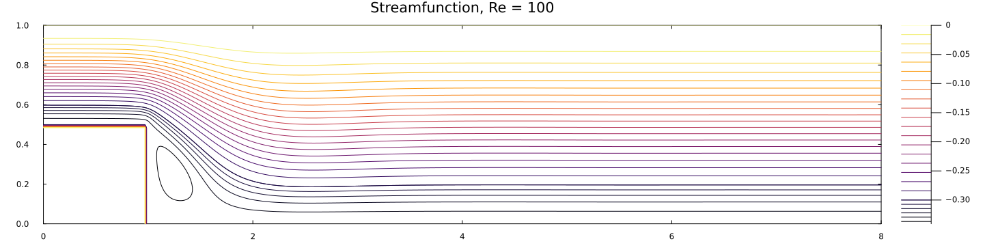
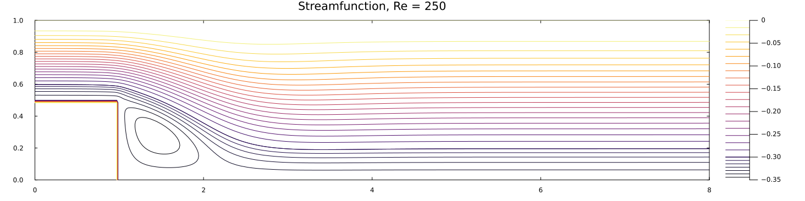
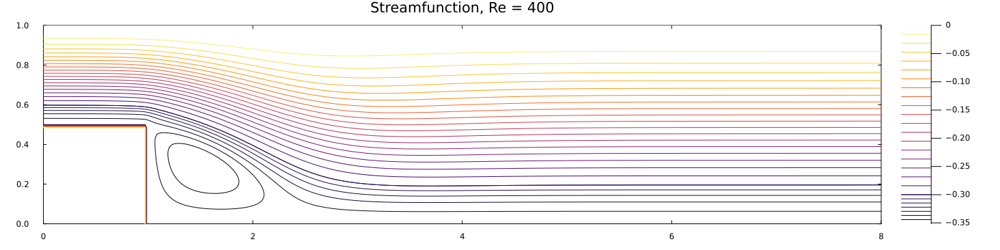
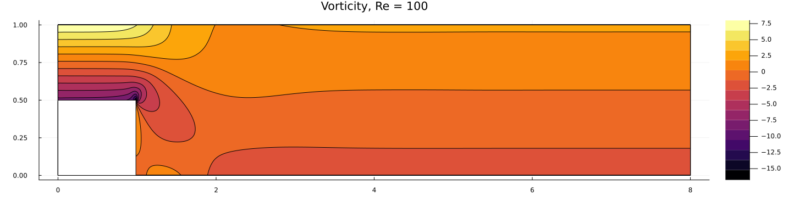
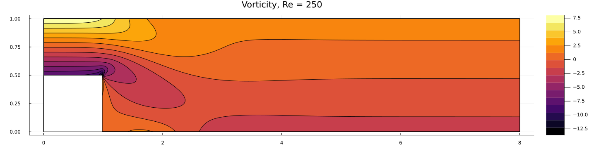
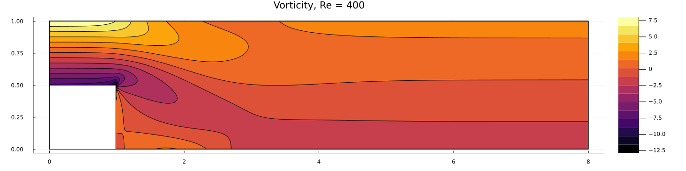
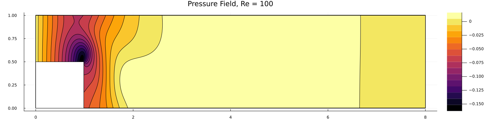
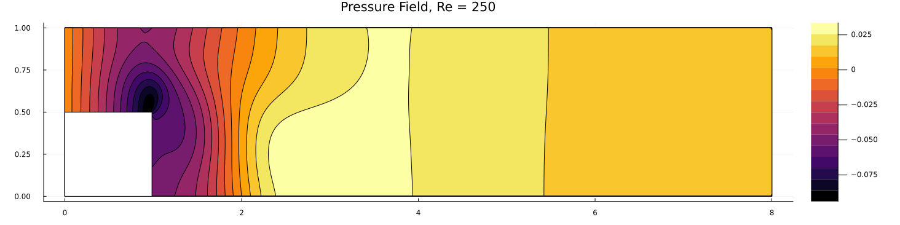
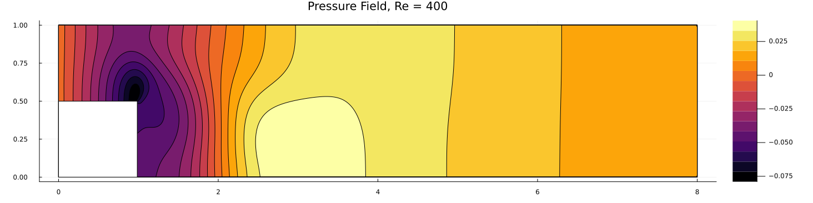

+++ 
draft = false
date = 2026-06-08T23:20:42-04:00
title = 'Streamfunction Vorticity'
description = ""
slug = ""
authors = []
tags = ['CFD', 'Julia']
categories = ['CFD']
externalLink = ""
series = ['CFD-in-Julia']
+++

The following post details a code I wrote as part of a CFD course.
It simulates flow over a backwards-facing step using the vorticity-streamfunction formulation.
Specifically, the assignment was to replicate the results from Roache and Mueller's 1970 paper "Numerical Solutions of Laminar Separated Flows".

# Vorticity-Streamfunction & Solution Procedure

The streamfunction $\psi$ is defined as:
$$
u = \frac{\partial \psi}{\partial y}, \quad v = -\frac{\partial \psi}{\partial x}
$$

The vorticity is defined as:
$$
\omega = \frac{\partial v}{\partial x} - \frac{\partial u}{\partial y}
$$

The vorticity transport equation can be obtained by substituting the definition for streamfunction into the Navier-Stokes momentum equations.
$$
\frac{\partial \omega}{\partial t} + u \frac{\partial \omega}{\partial x} + v \frac{\partial \omega}{\partial y} = \frac{1}{\text{Re}}\left(\frac{\partial^2\omega}{\partial x^2}+\frac{\partial^2\omega}{\partial y^2}\right)
$$

The solution procedure for the vorticity-streamfunction formulation (VSF) of the Navier-Stokes Equations (NSE) is as follows.

- Calculate $\omega$ from a velocity field $u$, $v$.
- March $\omega$ forward in time using the transport equation.
    - A first-order explicit Euler timestep ($\omega^{next}=\omega + \Delta t (\partial\omega/\partial t)$ and centered finite differences will be used for simplicity. Boundary conditions for $\omega$ will be enforced during this step.
- Solve for the streamfunction $\psi$ from the transported vorticity.
    - This requires the solution of an elliptic PDE ($\partial_{xx}\psi + \partial_{yy}\psi = -\omega$). The method of successive over-relaxation will be used. Boundary conditions for $\psi$ will be enforced during this step.
- Recover the velocity field $u$, $v$ from the streamfunction $\psi$.
    - Velocity boundary conditions are enforced during this step, and before the calculation of the vorticity in Step 1.
- The previous steps are repeated until a steady-state solution is reached. Afterwards, the pressure can be recovered (by solution of a Poisson equation).


# Boundary Conditions
In their work, Roache and Mueller simulated flow over the backwards-facing step with a free surface at the top of the domain.
The stated reason is that they are looking for the least restrictive and most natural boundary conditions.
The exact quote is: *"The boundary condition at the upper boundary or lid was somewhat disappointing. It had been desired to model the backstep with no upper boundary (free-flight case), but numerical experimentation did not disclose a method of allowing inflow through the mesh at the lid without destabilizing the solution."*
They also do not clearly specify the inlet boundary condition beyond stating that it is arrived at by integrating a Pohlhausen equation.
For simplicity (and maybe greater disappointment), this replication will alter the boundary conditions slightly to better constrain the problem.

The inlet is assumed to be a fully developed Poiseuille flow with a parabolic velocity profile. (As the simulation is 2D, it is assumed that the velocity profile corresponds to a fully developed flow between parallel plates.)
This allows for a uniform pressure distribution to be assumed at the inlet, and for this inlet pressure to be treated as a Dirichlet boundary condition.
This also has the benefit of simplifying the pressure recovery, which will be discussed later.
Finally, the top of the domain is treated with a no-slip condition rather than attempting to simulate a free surface.

It must be noted that these alterations will result in differences between Roache and Mueller's work and the results herein - the plots will not match exactly.
The location and size of recirculation zones behind the step will differ, as well as the exact contours for vorticity, pressure, and the streamfunction.
Direct comparisons will not be possible; instead, qualitative comparisons will be done to verify the code.

The following subsections discuss each of the boundary conditions necessary to define the simulation.

## Velocity
As stated previously, the inlet is placed on the left side of the domain, and a fully developed Poiseuille flow is assumed.
The velocity profile for a Poiseuille flow between two parallel plates, with the plates located at $y=h$ and $y=-h$ (so that the centerline of the flow path is at $y=0$), can be obtained with the following equation.
In the simulation, the inlet will not be between $\pm h$, but it is a relatively simple fix to translate the profile vertically.
<!--\begin{equation} \label{eqn:bc_u_inlet}-->
<div>
$$
u(y)\big|_{inlet} = u_{max}\bigg( 1 - \big(\frac{y}{h}\big)^2 \bigg)
$$
</div>
<!--\end{equation}-->
For any fully developed Poiseuille flow, the maximum velocity occurs at the centerline of the flow path.
There exist relations between the average and maximum velocity of the velocity profile, but they are not necessary here as the inlet boundary condition will be specified by $u_{max}$.

The outlet is on the right side of the domain.
Unlike the inlet, no velocity profile is assumed.
The only condition to be enforced at the outlet is that there is no velocity gradient, so that:
<!--\begin{equation} \label{eqn:bc_u_out}-->
<div>
$$
\frac{\partial u}{\partial x}\bigg|_{outlet}=0, \quad \frac{\partial v}{\partial x}\bigg|_{outlet}=0
$$
</div>
<!--\end{equation}-->

Impermeable walls with no-slip boundary conditions are assumed along the top and bottom of the domain.
<!--\begin{equation} \label{eqn:bc_u_topbot}-->
<div>
$$
u(x)\big|_{top}=0, \quad u(x)\big|_{bottom}=0
$$
</div>
<!--\end{equation}-->

## Streamfunction
The boundary conditions for the streamfunction must be calculated from the velocity boundary conditions.
As discussed previously, there are impermeability and no-slip boundaries at the top and bottom of the domain.
These are written as follows (including the definition of the streamfunction):
$$
v=-\frac{\psi}{\partial x} = 0, \quad u = \frac{\psi}{\partial y} = 0,
$$
For the top and bottom of the domain, it can be found that $\psi=C$ where $C$ is an integration constant.

To determine the value of this integration constant, the inlet to the domain must be considered.
The inlet velocity profile $u(y)$ is known, which means that $\partial \psi / \partial y$ is also known.
The streamfunction inlet boundary condition can then be obtained by integrating the $u$-velocity profile in the $y$ direction.
To set the integration constant, it will be assumed that the streamfunction is zero along the top of the domain, so that $\psi\big|_{top}=0$.
Note that the same $\pm h$ is assumed as in Equation \ref{eqn:bc_u_inlet}, as it is trivial to shift the profile up and down in code.
<!--\begin{equation} \label{eqn:bc_stream_inlet}-->
<div>
$$
\psi(y)\big|_{inlet} = u_{max} \bigg( y - \frac{y^3}{3\Delta y^2} \bigg)+C, \quad C = -\frac{2u_{max}\Delta y}{3}
$$
</div>
<!--\end{equation}-->
With this result in mind, the streamfunction is set to $0$ along the top of the domain and $-\frac{2u_{max}\Delta y}{3}$ along the bottom of the domain.

For the outflow condition, the streamfunction is simply extrapolated.
<!--\begin{equation} \label{eqn:bc_stream_outlet}-->
<div>
$$
\psi\big|_{N_x} = 2 \psi\big|_{N_x-1} - \psi\big|_{N_x-2}
$$
</div>
<!--\end{equation}-->

## Vorticity
As with the velocity and streamfunction, the vorticity at the inlet is known due to the assumption of a fully developed Poiseuille flow.
With the assumption that $\partial v / \partial x=0$ at the inlet, it is simply:
<!--\begin{equation} \label{eqn:bc_w_inlet}-->
<div>
$$
\omega(y)\big|_{inlet} = -\frac{\partial u}{\partial y} = \frac{2u_{max}y}{\Delta y^2}
$$
</div>
<!--\end{equation}-->

Unlike the streamfunction, the vorticity does not need to be held at a constant value along the top and bottom of the domain.
Relations such as Thom's method or Jensen's method must be used to determine the vorticity at the wall from the streamfunction.
Roache and Mueller use Thom's method, which is presented below.
Note that the $w$ subscript denotes a point on the wall, with $w+1$ indicating an interior point.
<!--\begin{equation} \label{eqn:bc_w_wall}-->
<div>
$$
\omega_w = -2(\psi_{w+1}-\psi_w)/\Delta n^2
$$
</div>
<!--\end{equation}-->

For the outlet, a simple no-gradient assumption is made.
<!--\begin{equation} \label{eqn:bc_w_out}-->
<div>
$$
\frac{\partial \omega}{\partial x} \bigg|_{outlet} = 0
$$
</div>
<!--\end{equation}-->

# Pressure Recovery
To recover the pressure after a steady-state solution has been obtained, the divergence of the momentum equations is taken, and the resulting Poisson equation is solved for pressure.
The pressure terms in the momentum equations are isolated as follows.
Note that, since the pressure is only recovered after a steady-state solution has been reached, $\partial u/\partial t$ and $\partial v/\partial t$ are $0$.
<!--\begin{equation} \label{eqn:dpdn}-->
$$
\begin{split}
    \frac{\partial p}{\partial x} = \frac{1}{Re}\bigg(\frac{\partial^2u}{\partial x^2}+\frac{\partial^2u}{\partial y^2}\bigg) - u\frac{\partial u}{\partial x} - v\frac{\partial u}{\partial y} \equiv f \\\\
    \frac{\partial p}{\partial y} = \frac{1}{Re}\bigg(\frac{\partial^2v}{\partial x^2}+\frac{\partial^2v}{\partial y^2}\bigg) - u\frac{\partial v}{\partial x} - v\frac{\partial v}{\partial y} \equiv g \\\\
\end{split}
$$
<!--\end{equation}-->
The divergence of the isolated momentum terms results in a Poisson equation for the pressure.
$$
\nabla^2 p = \frac{\partial}{\partial x}f + \frac{\partial}{\partial y}g
$$
In the following, $\partial_x\equiv \frac{\partial}{\partial x}$, and similarly for $y$.
This is done to enhance readability (and for ease of typing).
$$
\partial_x f = \frac{1}{Re}(\partial_{xxx}u + \partial_{yyx}u) - \partial_x(u\partial_x u + v\partial_y u)
$$
$$
\partial_x g = \frac{1}{Re}(\partial_{xxy}v + \partial_{yyy}v) - \partial_y(u\partial_x v + v\partial_y v)
$$
Plugging these back into the pressure Poisson equation (note the terms that equal zero due to continuity):
$$
\nabla^2 p = \frac{1}{Re}\big( \cancel{\partial_{xxx}u+\partial_{xxy}v} + \cancel{\partial_{yyx}u+\partial_{yyy}v} \big) - \partial_x(u\partial_x u + v\partial_y u)- \partial_y(u\partial_x v + v\partial_y v)
$$
$$
\nabla^2 p = -\partial_xu\partial_xu - u\partial_{xx}u - \partial_xv\partial_yu - v\partial_{xy}u - \partial_yu\partial_xv - u\partial_{xy}v - \partial_yv\partial_yv - v\partial_{yy}v
$$
$$
\nabla^2 p = -(\partial_x u)^2 - 2\partial_xv\partial_yu - (\partial_yv)^2 -u\partial_x\cancel{(\partial_xu+\partial_yv)} - v\partial_y\cancel{(\partial_xu+\partial_yv)}
$$
<!--\begin{equation} \label{eqn:pressure_poisson}-->
$$
\nabla^2 p = -(\partial_x u)^2 - 2\partial_xv\partial_yu - (\partial_yv)^2
$$
<!--\end{equation}-->

The equations for $\partial p / \partial x$ and $\partial p / \partial y$ can be used to set Neumann boundary conditions for the equation shown above, specifically along the top and bottom of the domain.
The outlet of the domain is assumed to have a simple Neumann boundary condition so that $\partial p/\partial x = 0$.
Note that if Neumann boundary conditions are assumed everywhere, this system will be indeterminate and will not converge, as the solution is unique up to an additive constant.
As described previously, the inlet pressure boundary was set to a Dirichlet boundary condition to simplify pressure recovery by eliminating this issue.
The pressure at the inlet is then set to zero.

# Simulation Results
The simulation domain is eight units wide and one unit tall.
Each unit is discretized with 61 grid points.
The backwards-facing step was placed in the bottom-left corner of the domain and has a height of half a unit and a length of one unit.
The maximum velocity of the inlet is set to $1.0$, and, as the non-dimensional form of the Navier-Stokes equations is used, the Reynolds number is directly set.
As transient equations were described previously, a steady-state solution was obtained by marching in time.
Convergence was determined when the $L2$-norm of the difference between iterations for both the vorticity and streamfunction decreased below a threshold of 1E-6.

Below are streamfunction contour plots for a Reynolds number of 100, 250, and 400.





Below are vorticity plots for a Reynolds number of 100, 250, and 400.





And last but not least, below are pressure contour plots for Reynolds numbers of 100, 250, and 400.





## Effect of Reynolds Number
<!--A contour plot of the streamfunction for multiple Reynolds numbers is shown in Figure \ref{fig:streamfunctions}.-->
<!--Similarly, a contour plot of the vorticity and pressure fields are shown in Figure \ref{fig:vorticity} and \ref{fig:pressure}.-->
The following effects can be observed as the Reynolds number increases:
- The recirculation zone behind the step increases in size.
- The point at which the flow reattaches to the lower edge of the domain moves further downstream. This is most easily observed in the plots of the streamfunction and the pressure field.
- The region of negative vorticity at the sharp corner of the step extends further to the right and down. This seems to be related to Roache and Mueller's observation of how the flow separation point moves down the vertical face of the step as the Reynolds number increases.
- The region of negative pressure at the sharp corner of the step increases in size but decreases in magnitude. This may be a result of decreased viscous stresses, and it is possible that the pressure spike will increase in magnitude again for higher Reynolds numbers.

# Source Code

```julia
using Plots
using Plots.Measures

"""
    Inlet velocity, streamfunction, and vorticity are set assuming a fully developed planar Poiseuille flow
"""

function velocityInletProfile!(u::Array{Float64,2}, nbot::Int64, ntop::Int64, u_max::Float64)
    nmid = (ntop + nbot) / 2
    h = nmid - nbot
    # println("ntop = $ntop, nbot = $nbot, nmid = $nmid")
    # poiseuille profile, centered at 0, from -h to h. shifted vertically via indexing the assignment
    yarr = collect(-h:h)
    u[1, nbot:ntop] = u_max * (1 .- (yarr / h) .^ 2)
end

function streamfunctionInletProfile!(phi::Array{Float64,2}, ny::Int64, u_max::Float64, dy::Float64; nx_step::Int64=1, ny_step::Int64=1)
    nmid = (ny_step + ny) / 2
    hgrid = (nmid - ny_step)
    h = hgrid * dy
    yarr = collect(-hgrid:hgrid) * dy
    phi[1, ny_step:end] = u_max * (yarr .- ((yarr) .^ 3) / (3 * h^2)) .- 2 * u_max * h / 3
    # hold top wall at value of inlet top corner (should be zero)
    phi[:, end] .= phi[1, ny]
    # entire bottom surface should be equal to value at bottom corner of inlet
    # horizontal face of step
    phi[1:nx_step, ny_step] .= phi[1, ny_step]
    # vertical face of step
    phi[nx_step, 1:ny_step] .= phi[1, ny_step]
    # bottom surface
    phi[nx_step:end, 1] .= phi[1, ny_step]
end

function vorticityInletProfile!(w::Array{Float64,2}, nbot::Int64, ntop::Int64, u_max::Float64, dy::Float64)
    nmid = (ntop + nbot) / 2
    hgrid = (nmid - nbot)
    h = hgrid * dy
    yarr = collect(-hgrid:hgrid) * dy
    w[1, nbot:ntop] = 2 * u_max * yarr / (h^2)
end

function calcVorticity!(u::Array{Float64,2}, v::Array{Float64,2}, w::Array{Float64,2}, phi::Array{Float64,2}, h::Float64; nx_step::Int64=1, ny_step::Int64=1)
    # interior of domain
    dv_dx = (v[3:end, 2:end-1] - v[1:end-2, 2:end-1]) / (2 * h)
    du_dy = (u[2:end-1, 3:end] - u[2:end-1, 1:end-2]) / (2 * h)
    w[2:end-1, 2:end-1] = dv_dx - du_dy
    # upper wall
    w[1:end, end] .= -2 * (phi[1:end, end-1] - phi[1:end, end]) / h^2
    # lower wall
    w[nx_step:end, 1] .= -2 * (phi[nx_step:end, 2] - phi[nx_step:end, 1]) / h^2
    # horizontal face of step
    w[1:nx_step, ny_step] .= -2 * (phi[1:nx_step, ny_step+1] - phi[1:nx_step, ny_step]) / h^2
    # vertical face of step
    # note that the corner uses the vorticity boundary as calculated from the horizontal face
    # for the bottom corner it doesn't really matter since that value should never be picked up by the 5-point stencil
    w[nx_step, 1:ny_step-1] .= -2 * (phi[nx_step+1, 1:ny_step-1] - phi[nx_step, 1:ny_step-1]) / h^2
end

function buildStepMask(nx, ny, nx_step, ny_step)::BitMatrix
    mask = trues(nx, ny)
    mask[1:nx_step, 1:ny_step] .= false   # block out step in bottom-left
    return mask
end

function transportVorticity!(dw_dt::Array{Float64,2}, w::Array{Float64,2}, cu::Array{Float64,2}, cv::Array{Float64,2}, Re::Float64, h::Float64, mask::BitMatrix)
    dw_dx = (w[3:end, 2:end-1] - w[1:end-2, 2:end-1]) / (2 * h)
    dw_dy = (w[2:end-1, 3:end] - w[2:end-1, 1:end-2]) / (2 * h)
    d2w_dx2 = (w[3:end, 2:end-1] - 2 * w[2:end-1, 2:end-1] + w[1:end-2, 2:end-1]) / (h^2)
    d2w_dy2 = (w[2:end-1, 3:end] - 2 * w[2:end-1, 2:end-1] + w[2:end-1, 1:end-2]) / (h^2)

    dw_dt[2:end-1, 2:end-1] = ((1 / Re) * (d2w_dx2 + d2w_dy2) - cu[2:end-1, 2:end-1] .* dw_dx - cv[2:end-1, 2:end-1] .* dw_dy) .* mask[2:end-1, 2:end-1]
end

function solveStreamfunction!(phi::Array{Float64,2}, w::Array{Float64,2}, h::Float64; nx_step::Int64=1, ny_step::Int64=1, relax::Float64=1.0, tol::Float64=1e-5, max_itr::Int64=10000)
    nx, ny = size(phi)
    for itr = 1:max_itr
        update::Float64 = 0.0
        for j in 2:ny-1
            i_start = (j <= ny_step) ? nx_step + 1 : 2  # skip step nodes
            for i in i_start:nx-1
                new_value = (
                    phi[i+1, j] + phi[i-1, j] + phi[i, j+1] + phi[i, j-1]
                    +
                    w[i, j] * h^2
                ) / 4
                update += abs(new_value - phi[i, j])
                phi[i, j] = (1 - relax) * phi[i, j] + relax * new_value
            end
        end
        # extrapolate at the outlet
        for j in 2:ny-1
            new_value = 2 * phi[nx-1, j] - phi[nx-2, j]
            update += abs(new_value - phi[nx, j])
            phi[nx, j] = new_value
        end
        if update <= tol
            #println("Solver converged in $itr iterations")
            break
        end
        if itr == max_itr
            println("Warning: Max iterations reached in S.O.R. routine!")
        end
    end
end

function recoverVelocity!(u::Array{Float64,2}, v::Array{Float64,2}, phi::Array{Float64,2}, h::Float64; nx_step::Int64=1, ny_step::Int64=1)
    u[2:end-1, 2:end-1] = (phi[2:end-1, 3:end] - phi[2:end-1, 1:end-2]) / (2h)
    v[2:end-1, 2:end-1] = -(phi[3:end, 2:end-1] - phi[1:end-2, 2:end-1]) / (2h)
    # zero out velocities inside the step
    u[1:nx_step, 1:ny_step] .= 0.0
    v[1:nx_step, 1:ny_step] .= 0.0
end

function recoverPressurePoisson!(p::Array{Float64,2}, u::Array{Float64,2}, v::Array{Float64,2}, Re::Float64, h::Float64;
    nx_step::Int64=1, ny_step::Int64=1, relax::Float64=1.0, tol::Float64=1e-5, max_itr::Int64=20000)

    nx, ny = size(p)
    rhs = zeros(nx, ny)

    # RHS is 2*(ux*vy - vx*uy)
    for i in 2:nx-1, j in 2:ny-1
        ux = (u[i+1, j] - u[i-1, j]) / (2h)
        uy = (u[i, j+1] - u[i, j-1]) / (2h)
        vx = (v[i+1, j] - v[i-1, j]) / (2h)
        vy = (v[i, j+1] - v[i, j-1]) / (2h)
        rhs[i, j] = 2 * (ux * vy - vx * uy)
    end

    for itr in 1:max_itr
        update = 0.0
        for j in 2:ny-1
            i_start = (j <= ny_step) ? nx_step + 1 : 2
            for i in i_start:nx-1
                new_value = (p[i+1, j] + p[i-1, j] + p[i, j+1] + p[i, j-1] - rhs[i, j] * h^2) / 4
                update += abs(new_value - p[i, j])
                p[i, j] = (1 - relax) * p[i, j] + relax * new_value
            end
        end

        # set boundary conditions using dp/d{n} from momentum equation

        # top wall
        # dp/dy = (1/Re) d2v/dy2
        # v_wall = 0, so dp/dy = (1/Re) * (-2*v[i, ny-1] + v[i, ny-2]) / h^2
        for i in 2:nx-1
            dp_dy = (1 / Re) * (-2 * v[i, ny-1] + v[i, ny-2]) / h^2
            p[i, ny] = p[i, ny-1] + h * dp_dy
        end

        # bottom wall
        for i in nx_step+1:nx-1
            dp_dy = (1 / Re) * (2 * v[i, 2] - v[i, 3]) / h^2
            p[i, 1] = p[i, 2] - h * dp_dy
        end

        # horizontal face
        for i in 1:nx_step
            dp_dy = (1 / Re) * (2 * v[i, ny_step+1] - v[i, ny_step+2]) / h^2
            p[i, ny_step] = p[i, ny_step+1] - h * dp_dy
        end

        # vertical face: dp/dx = (1/Re) * d2u/dx2
        for j in 1:ny_step
            dp_dx = (1 / Re) * (2 * u[nx_step+1, j] - u[nx_step+2, j]) / h^2
            p[nx_step, j] = p[nx_step+1, j] - h * dp_dx
        end

        # outlet is neumann
        for j in 2:ny-1
            p[nx, j] = p[nx-1, j]
        end

        # inlet is dirichlet
        p[1, ny_step:ny] .= 0.0

        # smooth corner?
        p[nx_step, ny_step] = 0.5 * (p[nx_step-1, ny_step] + p[nx_step, ny_step-1])

        if update < tol
            println("Pressure converged in $itr iterations.")
            break
        end
    end
    return p
end

function main()
    # domain information
    n::Int64 = 61
    h::Float64 = 1 / (n - 1)
    Lx::Float64 = 8
    Ly::Float64 = 1
    nx::Int64 = n * Lx
    ny::Int64 = n * Ly
    x = range(0, Lx, nx)
    y = range(0, Ly, ny)
    println("n = $n, h = $h, Lx = $Lx, Ly = $Ly, nx = $nx, ny = $ny")

    # set the size of the step, assuming it is located in bottom left corner
    nx_step::Int64 = 61
    ny_step::Int64 = 31
    mask = buildStepMask(nx, ny, nx_step, ny_step)

    # 2D velocity field
    u = zeros(nx, ny)
    v = zeros(nx, ny)
    # vorticity
    vor = zeros(nx, ny)
    # streamfunction
    phi = zeros(nx, ny)
    # velocity field for recovery at end
    p = zeros(nx, ny)

    # simulation parameters
    Re = 100.
    Cmax = 0.9
    dt = min(h / 1.0, h^2 * Re / 4) * Cmax
    println("dt = $dt")
    T_now = 0.0
    T_end = 25.0

    # simulation variables
    dw_dt = zeros(nx, ny)
    vor_old = zeros(nx, ny)
    phi_old = zeros(nx, ny)
    vor_hist = []
    phi_hist = []

    # inlet profiles
    nbot::Int64 = ny_step
    ntop::Int64 = n
    umax::Float64 = 1.0
    velocityInletProfile!(u, nbot, ntop, umax)
    streamfunctionInletProfile!(phi, ny, umax, h, nx_step=nx_step, ny_step=ny_step)
    vorticityInletProfile!(vor, nbot, ntop, umax, h)

    # before time loop propagate the inlet profiles
    solveStreamfunction!(phi, vor, h, relax=1.9, nx_step=nx_step, ny_step=ny_step)
    recoverVelocity!(u, v, phi, h, nx_step=nx_step, ny_step=ny_step)
    velocityInletProfile!(u, nbot, ntop, umax)

    tstep::Int64 = 0
    while T_now < T_end
        # get vorticity from velocity
        calcVorticity!(u, v, vor, phi, h, nx_step=nx_step, ny_step=ny_step)
        vorticityInletProfile!(vor, nbot, ntop, umax, h)
        # transport vorticity
        dw_dt .= 0
        transportVorticity!(dw_dt, vor, u, v, Re, h, mask)
        vor .+= dt .* dw_dt
        vor[end, :] .= vor[end-1, :]
        # solve for streamfunction
        solveStreamfunction!(phi, vor, h, relax=1.9, nx_step=nx_step, ny_step=ny_step)
        # recover velocity
        recoverVelocity!(u, v, phi, h, nx_step=nx_step, ny_step=ny_step)
        velocityInletProfile!(u, nbot, ntop, umax)
        u[end, :] .= u[end-1, :]
        v[end, :] .= v[end-1, :]
        # store history
        norm_vor = sum(abs.(vor - vor_old) .^ 2)
        norm_phi = sum(abs.(phi - phi_old) .^ 2)
        push!(vor_hist, norm_vor)
        push!(phi_hist, norm_phi)
        # complete timestep
        if tstep % 50 == 0
            println("T = $T_now")
        end
        if any(isnan, vor) || any(isnan, phi)
            println("NaN detected at step $tstep, T=$T_now")
            break
        end
        tstep = tstep + 1
        T_now = T_now + dt
        vor_old .= vor
        phi_old .= phi
        if norm_vor < 1e-6 && norm_phi < 1e-6
            println("Converged to steady-state")
            break
        end
    end

    # recover pressure
    recoverPressurePoisson!(p, u, v, Re, h, nx_step=nx_step, ny_step=ny_step, relax=1.5)

    sz_x = 3
    sz_y = 6
    aspect = :auto

    default(margin=5mm, guidefontsize=10)

    contour(x, y, phi',
        aspect_ratio=aspect,
        framestyle=:box,
        size=(nx * sz_x, ny * sz_y),
        xlims=(x[1], x[end]),
        ylims=(y[1], y[end]),
        clabels=false,
        cbar=true,
        legend=:none, grid=:none,
        levels=vcat(range(-0.44, -0.30, length=20), range(-0.30, 0, length=20)),
        title="Streamfunction, Re = $(convert(Int64, Re))"
    )
    savefig("plots/streamfunction$(convert(Int64, Re)).png")

    plot(log10.(vor_hist), label="Norm of Vorticity Change", title="Convergence, Re = $(convert(Int64, Re))", xlabel="Iteration", ylabel="L2 Norm, Power of Ten")
    plot!(log10.(phi_hist), label="Norm of Streamfunction Change")
    savefig("plots/change$(convert(Int64, Re)).png")

    contourf(x, y, vor', aspect_ratio=aspect, size=(nx * sz_x, ny * sz_y), title="Vorticity, Re = $(convert(Int64, Re))")
    step_shape = Shape([0, x[nx_step], x[nx_step], 0], [0, 0, y[ny_step], y[ny_step]])
    plot!(step_shape, fillcolor=:white, linecolor=:black, label=false)
    savefig("plots/vorticity$(convert(Int64, Re)).png")

    contourf(x, y, p', aspect_ratio=aspect, size=(nx * sz_x, ny * sz_y), title="Pressure Field, Re = $(convert(Int64, Re))")
    step_shape = Shape([0, x[nx_step], x[nx_step], 0], [0, 0, y[ny_step], y[ny_step]])
    plot!(step_shape, fillcolor=:white, linecolor=:black, label=false)
    savefig("plots/pressure$(convert(Int64, Re)).png")

    # the quiver plot formating in Plots.jl is broken
    # try to fix with downsampling and rescaling
    skp = 5
    scl = 7

    X, Y = [x[i] for j in 1:skp:ny, i in 1:skp:nx], [y[j] for j in 1:skp:ny, i in 1:skp:nx]

    uq = u[1:skp:nx, 1:skp:ny]' ./ scl
    vq = v[1:skp:nx, 1:skp:ny]' ./ scl

    quiver(X, Y, quiver=((uq), (vq)), color=:black, arrow=arrow(:head, 0.005, 0.002), aspect_ratio=aspect, size=(nx * sz_x, ny * sz_y), title="Velocity Quiver Plot")
    savefig("plots/quiverplot$(convert(Int64, Re)).png")

end

if abspath(PROGRAM_FILE) == @__FILE__
    # testInletProfile()
    main()
end
```